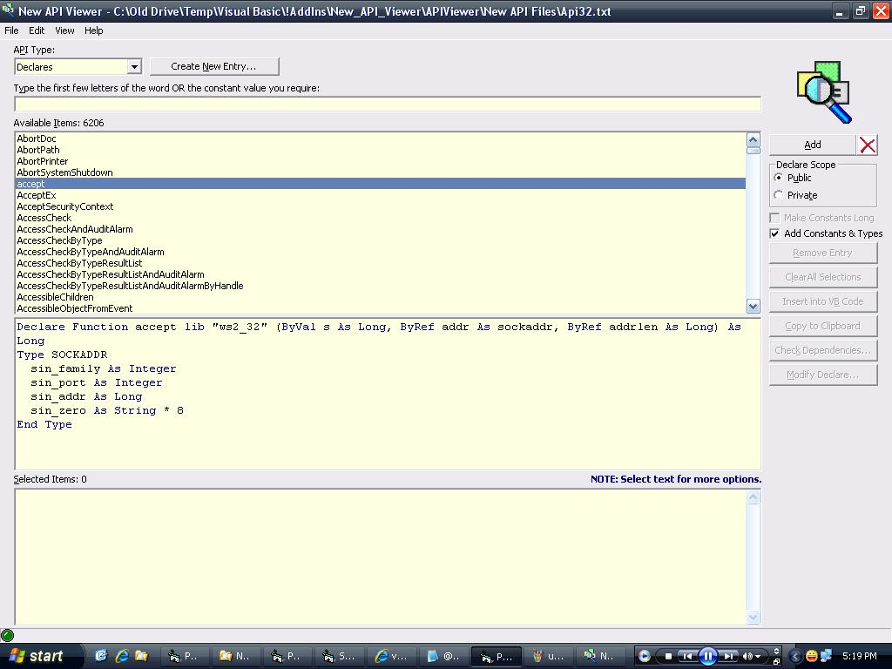



## New API Viewer Modified with value searching and preview

### Description

I have modified this code from http://www.planet-source-code.com/vb/scripts/ShowCode.asp?txtCodeId=68349&amp;lngWId=1 (many thanks to David for his submission). Modifications: Added a richtext preview window, that makes it look like the VB IDE. Added a 'add constants &amp; types' checkbox when you're looking through declarations. This will grab whatever constants and types are listed in the declaration, and append them to the preview. Added ability to search through constant+enum values. The reason I modified this, was I because I was intercepting windows messages and thought this would be a fast way to see what the messages might mean... So in the search textbox, you can now either look for a declaration, constant, type or enum as before, but you can also enter in values. For example, let's say you've subclassed a window, and all these numbers are coming through your debug window, how are you meant to know what means what? Well, if you enter &amp;H9 in the textbox, all the constants and enumerations with the value &amp;H9 will be shown in the preview window. Pretty handy if you ask me... There were a few other bugs I found in the beginning which I should have noted down, but I just went ahead and fixed them. From memory, one of them was it was looking in the wrong listbox for the 'subs' (thinking it was looking in the declaration listbox).
 
### More Info
 

             |
---                |---
**Submitted On**   |2008-01-20 17:01:42
**By**             |[ Jon](https://github.com/Planet-Source-Code/PSCIndex/blob/master/ByAuthor/jon.md)
**Level**          |Advanced
**User Rating**    |5.0 (10 globes from 2 users)
**Compatibility**  |VB 6\.0
**Category**       |[Windows API Call/ Explanation](https://github.com/Planet-Source-Code/PSCIndex/blob/master/ByCategory/windows-api-call-explanation__1-39.md)
**World**          |[Visual Basic](https://github.com/Planet-Source-Code/PSCIndex/blob/master/ByWorld/visual-basic.md)
**Archive File**   |[New\_API\_Vi2098761232008\.zip](https://github.com/Planet-Source-Code/jon-new-api-viewer-modified-with-value-searching-and-preview__1-69969/archive/master.zip)

